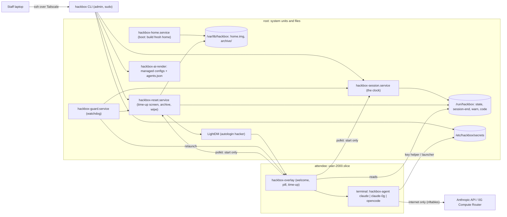
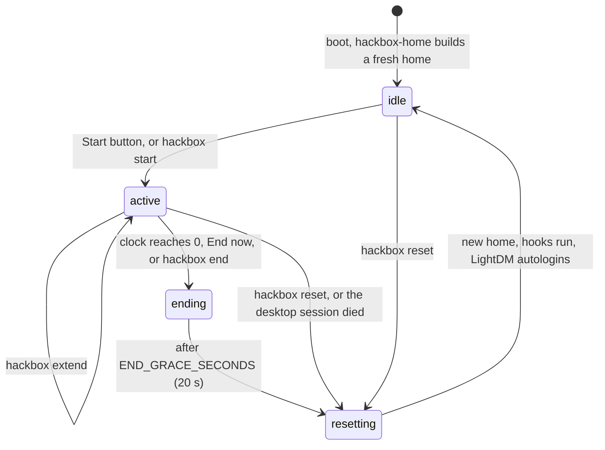

# How a hack box works

For the next maintainer. What runs where, why, and what it does and does not defend. Install
steps are in `INSTALL.md`, keys in `SECRETS.md`, day-of operations in `EVENT-RUNBOOK.md`.

## In one paragraph

An attendee account (`hacker`) autologins into Cinnamon on a home directory that is a
throwaway ext4 image. A root-owned timer runs the 30 minute slot; the attendee can start it
and end it early, nothing else. At the end a root reset kills everything the attendee owns,
archives `~/project`, builds a new image from a skeleton and brings back the welcome screen,
in about a second. The organisers' admin account is only reachable over ssh on the tailnet.
Claude Code and OpenCode are installed system-wide and configured by root-owned managed
policies; which of them the welcome screen offers is one command. A firewall, resource caps,
polkit, desktop locks and a browser policy keep the attendee inside their slot.

## Components

## Two accounts

| | Admin (`hackadmin`) | Attendee (`hacker`) |
|---|---|---|
| Created by | the Mint installer | `setup/60-hacker.sh` |
| UID | 1000 (installer default) | 2000, group 2000 only |
| Password | set at install | locked (`usermod -L`) |
| sudo | passwordless (`40-ssh.sh`) | none; also excluded from Mint's `ALL ALL = NOPASSWD` helper rules |
| Login | ssh key-only, over the tailnet; hidden from the greeter | LightDM autologin into Cinnamon; `DenyUsers hacker` in sshd |
| Home | normal, mode 0750 or tighter | loop-mounted image, wiped every slot |

Bootstrap and every setup script run as the admin user and call `sudo` themselves. Nothing
hard-codes the admin's name; scripts use `$USER`.

## Files and paths

| Path | What |
|---|---|
| `/opt/hack-box` | this repo; `/usr/local/bin/hackbox` is a symlink to `bin/hackbox` in it |
| `/etc/hackbox/conf.d/*.conf` | shell `KEY=value`, sourced in order by every helper: `10-session.conf`, `20-ai.conf`, `30-lockdown.conf` from the repo (overwritten on every run), plus local `29-ai-local.conf`, `39-lockdown-local.conf`, `90-local.conf` (never touched) |
| `/etc/hackbox/skel/` | the attendee home skeleton, assembled from `files/skel/` |
| `/etc/hackbox/reset.d/` | reset hooks, run as root after every wipe |
| `/etc/hackbox/secrets/` | agent keys, root:hacker 0750, key files root:hacker 0640 |
| `/etc/hackbox/agents.json`, `agents.selected`, `ai/launch.env` | generated agent manifest, saved selection, launcher settings (no secrets) |
| `/etc/claude-code/managed-settings.json`, `/etc/opencode/opencode.json` | generated managed agent policies |
| `/var/lib/hackbox/home.img` | the attendee home image |
| `/var/lib/hackbox/archive/` | project archives, root 0700, files 0600 |
| `/var/lib/hackbox/last-reset` | `<epoch> <seconds>` of the last reset |
| `/run/hackbox/` | root-written, world-readable runtime state (below) |
| `/usr/local/sbin/hackbox-*` | root helpers: `hackbox-reset`, `hackbox-session`, `hackbox-guard`, `hackbox-archive`, `hackbox-on-logout`, `hackbox-ai-render` |
| `/usr/local/lib/hackbox/` | `hackbox-overlay` (runs as the attendee), `ai/key` (Claude Code key helper) |
| `/usr/local/bin/hackbox-agent` | the agent launcher the welcome buttons run |

## The disposable home

`/home/hacker` is an ext4 image, `/var/lib/hackbox/home.img`, loop-mounted
`nosuid,nodev,noatime`. The bare mount point is `chattr +i`, so if the image is ever not
mounted, writes fail instead of landing on the root filesystem.

- Size `HOME_IMG_SIZE` (40G). The blocks are reserved with `fallocate`, not sparse, so a full
  home cannot fill the system disk. If the disk has less than the size plus `HOME_IMG_RESERVE`
  (4G) free, the image shrinks to fit and the reset logs it.
- `mkfs.ext4` with no journal and lazy inode tables: rebuilding a 40G home takes well under a
  second. The image never outlives a slot, so crash consistency buys nothing.
- If the image cannot be built, a 4 GB tmpfs home is mounted instead and
  `/run/hackbox/degraded` is set; `hackbox status` shows it. The box is never left without a
  home.
- `/tmp`, `/var/tmp` and `/dev/shm` are size-capped tmpfs (2G, 1G, 2G) from `/etc/fstab`,
  active from the first reboot after install.

`hackbox-home.service` runs `hackbox-reset --boot` before LightDM starts (a drop-in makes
`lightdm.service` require it), so every boot, including after a power cut, lands on a fresh
home.

## The session state machine

`/run/hackbox/state` holds one word. Only root writes it.

| State | Screen | Runtime files |
|---|---|---|
| `idle` | full-screen welcome, one button per agent | none |
| `active` | countdown pill, warnings at `WARN_MINUTES` (5 and 1) | `session-end` (epoch), `warn` (`<minutes> <epoch>`) |
| `ending` | full-screen "Time is up" with the pickup code | `code`, `ending-until` |
| `resetting` | "Resetting this machine" | `generation` |

Other files in `/run/hackbox`: `reset-now` (root-only flag: skip the time-up screen),
`start-minutes` (slot length for `hackbox start N`, consumed at start), `degraded`,
`reset.lock`.

### The clock and the guard

`hackbox-session.service` runs `/usr/local/sbin/hackbox-session` as root. From `idle` it
writes `session-end` and `state=active`, then ticks once a second: it re-reads `session-end`
(so `hackbox extend` works), writes `warn` when a threshold is crossed, and at zero starts
`hackbox-reset.service`. It restarts after a crash and resumes the same end time. Nothing
the attendee can write is ever read.

`hackbox-guard.service` is always on and checks every 2 seconds:

1. the overlay runs in the attendee's X session; if not, it relaunches it (as a transient
   unit in the attendee's user manager, falling back to `runuser`);
2. if the attendee's X session disappeared (X crash, a logout that slipped through) and no
   reset started, it starts one after 15 s;
3. if the state is `active` but the timer unit is not running, it starts it again;
4. if the state is stuck in `ending` or `resetting` with no reset running for 30 s, it starts
   a fresh reset.

LightDM's `session-cleanup-script` (`hackbox-on-logout`) is the other backstop: any end of the
attendee's session outside a reset starts an immediate reset.

### The reset

`/usr/local/sbin/hackbox-reset`, under a lock so only one runs at a time. No `set -e`: every
step is best effort with a timeout, and the one hard promise is that a home is mounted at
the end.

1. If a session is `active` and `reset-now` is not set: state `ending`, stop the timer, make
   a pickup code if `~/project` differs from the skeleton, show the time-up screen for
   `END_GRACE_SECONDS`.
2. State `resetting`. Stop the timer, queue a stop of LightDM and kill the attendee's cgroup
   at once (`cgroup.kill`), so LightDM cannot autologin into a half-built home.
3. Kill everything uid 2000 owns: `cgroup.kill`, `loginctl terminate-user`, slice SIGKILL, a
   `pkill -KILL` loop, stop `user@2000`.
4. Unmount anything the attendee mounted (FUSE, USB sticks under `/media/hacker`).
5. Archive `~/project` (after the kill, so files are closed and nothing races tar).
6. Clean the attendee's traces outside the home: linger, crontab, at jobs, files in `/tmp`,
   `/var/tmp`, `/dev/shm`, `/dev/mqueue`, SysV IPC, core dumps, mail, LightDM and
   AccountsService data, the attendee's archived journal files.
7. Unmount the home, build a new image, mount it, copy `/etc/hackbox/skel/.` in, fix
   ownership.
8. Run every executable in `/etc/hackbox/reset.d/` in order, with `HB_HOME`, `HB_USER`,
   `HB_UID` exported, 60 s each; a failing hook is logged and the reset continues.
9. State `idle`, start LightDM, write `last-reset`.

Measured in the lab: steps 2 to 9 take 0.5 to 1.1 s; from the end of a slot to the next
welcome screen about 21.6 s (20 s of that is the time-up screen). Logs go to the journal with
tag `hackbox-reset`.

At boot (`--boot`) there is no time-up screen, no archive and no LightDM restart.

### The work archive

`hackbox-archive create` tars `~/project` to `/var/lib/hackbox/archive/<code>.tar.gz`
(root 0600). Left out: dependency and build directories (`node_modules`, `.next`, `dist`,
`build`, `target`, `.venv` and others), secret-looking files (`.env`, `.env.*`, `*.pem`,
`*.key`, `id_*`, `.git-credentials`, `*.keystore`, `.npmrc`), `.git` objects when `.git` is over
`ARCHIVE_GIT_MAX_MB` (50), and files past `ARCHIVE_MAX_MB` (200) in total, smallest kept first.
Symlinks are stored, never followed. Codes are 6 characters without 0/O/1/I. An hourly timer
deletes archives older than `ARCHIVE_HOURS` (24). A project identical to the skeleton is not
archived. Archives are not encrypted.

### The polkit gate

`/etc/polkit-1/rules.d/10-hackbox.rules`. For the user `hacker`:

- `org.freedesktop.systemd1.manage-units`: **yes** only for verb `start` on
  `hackbox-session.service` (the Start button) and `hackbox-reset.service` (End now); **no**
  for every other unit and verb, so the attendee cannot stop the clock.
- USB sticks: udisks mount, eject and power-off allowed.
- A few harmless desktop actions (RealtimeKit, login1 inhibitors) allowed, to avoid log noise.
- Everything else **no**, without a prompt: power off, reboot, suspend, linger,
  NetworkManager changes, package installs, pkexec, time and hostname.

### The overlay

`/usr/local/lib/hackbox/hackbox-overlay`, Python 3 and GTK 3 (both ship with Mint),
autostarted from the skeleton and relaunched by the guard. It is display only: it reads
`/run/hackbox` twice a second and asks systemd, through polkit, to start the timer or the
reset. Killing it changes nothing about the clock.

- `idle`: full-screen, keep-above welcome; one button per entry in `/etc/hackbox/agents.json`,
  or a single "Start my session" if the manifest is missing. A button starts the timer, then
  opens `gnome-terminal --maximize` in `~/project` running the entry's `command` through
  `bash -lc`; when the agent exits, the terminal stays as a normal shell.
- `active`: an override-redirect countdown pill with "End now" (confirmation dialog), amber
  at 5:00, red at 1:00, plus its own warning toasts (notification popups are off on these
  boxes).
- `ending` and `resetting`: full-screen faces.
- Type scales with the monitor height, so 1080p and 4K look the same.

The manifest is read when the overlay starts, so a changed agent selection shows on the
welcome screen after the next reset.

## The agents

Both harnesses are installed system-wide by `setup/30-tools.sh`, so they survive the home
wipe and the attendee cannot modify them:

- Claude Code from Anthropic's signed apt repository (signing key fingerprint checked),
  `/usr/bin/claude`, package held. `CLAUDE_CODE_UPGRADE=1 bash setup/30-tools.sh` moves it on.
- OpenCode, a pinned release binary (`OPENCODE_VERSION`, 1.18.33) in `/usr/local/bin`,
  checked against the sha256 GitHub publishes and against `OPENCODE_SHA256`.

Neither updates itself: apt packages never do, and the managed configs switch updates off.

### Three combinations

| Id | Harness | Backend | How it authenticates |
|---|---|---|---|
| `claude` | Claude Code | Anthropic (`CLAUDE_AUTH`: `apikey`, `gateway` or `subscription`) | `apiKeyHelper` for apikey and gateway; `CLAUDE_CODE_OAUTH_TOKEN` exported by the launcher for subscription |
| `claude-0g` | Claude Code | 0G Compute Router, Anthropic-compatible path (`ANTHROPIC_BASE_URL=OG_ROUTER_URL`), models `OG_MODEL` / `OG_SMALL_MODEL` | `apiKeyHelper` with `0g-router-key` |
| `opencode` | OpenCode | 0G Compute Router, OpenAI-compatible path (`OG_ROUTER_URL/v1`) | `{env:ZG_ROUTER_API_KEY}`, exported by the launcher |

`hackbox agents set <ids>` runs `hackbox-ai-render` as root, which reads `conf.d` and writes:

- `/etc/claude-code/managed-settings.json`: top-precedence Claude Code policy. Always:
  `acceptEdits` by default, bypass-permissions mode disabled, deny `sudo`, `su`, `pkexec` and
  reads of the secrets and policy directories, updates, telemetry, error reporting, feedback,
  login, logout and extra-usage commands off, managed hooks and MCP servers only (none),
  no connectors, plugin marketplaces or sideload flags, remote control off, no auto-continue at
  usage limits, `maxEffortLevel`, the announcement line. For `claude`: the model allowlist
  (`CLAUDE_MODELS`, Sonnet and Haiku) enforced, default Sonnet. For `claude-0g`: the 0G base URL
  and model mappings from 0G's own Claude Code guide, a model picker that lists only the 0G
  models, and no Claude allowlist (the Router key's `allowed_models` is the limit).
- `/etc/opencode/opencode.json`: OpenCode's managed config. Only provider `0g`, default model
  `OG_MODEL`, small model `OG_SMALL_MODEL`, fallback `OG_FALLBACK_MODEL` listed, autoupdate off,
  sharing disabled, edits allowed, shell commands ask except a short allowlist, `sudo`/`su`/
  `pkexec` denied.
- `/etc/hackbox/agents.json`: the welcome manifest, one entry per offered agent, `command`
  `/usr/local/bin/hackbox-agent <id>`.
- `/etc/hackbox/agents.selected` and `/etc/hackbox/ai/launch.env`.

No secret ever goes into these files; the policy files are world-readable. `claude` and
`claude-0g` are mutually exclusive because Claude Code has one managed policy per machine.
Rerunning `65-ai.sh` keeps the saved selection.

`hackbox-agent <id>` (what the buttons run) checks that the agent is offered and its key file
exists, prints one friendly "please ask a staff member" line if not, exports the key where the
harness needs it in the environment, and starts the harness in `~/project`.

The reset hook `50-ai-seed` prepares every fresh home: `~/.claude.json` with onboarding done
and `~/project` trusted, a dark theme for Claude Code (no first-run dialogs), and, when
`opencode` or `claude-0g` is offered, `~/.config/hackbox/env` with `ZG_ROUTER_API_KEY`,
`OG_ROUTER_URL` and `OG_MODEL` for the attendee's own code (the starter kit's compute example
reads them).

## Lockdown controls

Applied by `setup/80-lockdown.sh` (plus `40-ssh.sh`, `60-hacker.sh` and `70-session.sh`
where noted); checked by `hackbox lock status`.

| Control | Mechanism | Defends against |
|---|---|---|
| No privilege | no sudo or admin groups, Mint's `ALL ALL` sudo helpers exclude `hacker`, `pam_wheel group=sudo` (`requisite`) on `su`, locked password | the attendee becoming root, or brute-forcing `su` |
| No persistence tools | `cron.deny`, `at.deny`, linger disabled (and cleaned at every reset) | work or processes surviving into the next slot |
| No ssh as the attendee | `DenyUsers hacker` (`40-ssh.sh`) | a key planted in the home giving remote access |
| Admin home closed | `chmod o-rwx` on the admin home | reading the admin's files and keys |
| No text consoles | logind `NAutoVTs=0`, `ReserveVT=0`; Xorg `DontVTSwitch`, `DontZap` | Ctrl+Alt+Fn to a login prompt, Ctrl+Alt+Backspace to kill X |
| Resource caps | `user-2000.slice`: `MemoryMax` 75% of RAM, `MemoryHigh` eleven twelfths of that, `MemorySwapMax` 2G, `CPUQuota` (threads minus 2) x 100%, `TasksMax` 4096; `nproc` 4096 in pam_limits | a fork bomb or memory hog freezing sshd, Xorg or the reset |
| Attendee firewall | own nftables table `inet hackbox` (`hackbox-nft.service`), for uid 2000 only: loopback and DNS to the gateway allowed, private, CGNAT (tailnet), link-local, multicast and IPv6 ULA ranges and anything via `tailscale0` rejected, public internet open; inbound for everyone: only loopback, tailnet, established, ICMP, DHCP and Tailscale's UDP port | reaching the tailnet, the venue LAN, router admin pages or cloud metadata; the LAN reaching the attendee's dev server or sshd |
| Tailnet tag (optional) | `TS_TAG` joins as `tag:hackbox` with `--accept-routes=false`; the ACL fragment gives the tag no outbound grants | a box (even as root, or via tailscaled's local API) reaching tailnet peers |
| Desktop locks | system dconf database with locks: no logout, user switching, lock screen, idle, sleep, power button action, printing, auto-open of USB media; Ctrl+Alt+L unbound | stranding the kiosk behind a lock screen (the attendee has no password), ending the session early by accident |
| Lock screen escape hatch | `pam_succeed_if user = hacker` first in `/etc/pam.d/cinnamon-screensaver` only | Cinnamon 6.6 still locks from some paths even with the dconf locks |
| Chromium policy | no sign-in, sync, password manager, autofill, guest or new profiles; extensions blocked except MetaMask; DevTools on; home page docs.0g.ai | personal accounts and passwords being saved on a shared machine |
| USB storage | allowed (sticks mount `nosuid,nodev` under `/media/hacker`, no auto-open), or `USB_STORAGE=block` | autorun; `block` stops copying out entirely |
| Agent policies | managed settings above | agents running `sudo`, bypassing permission prompts, loading MCP servers or plugins, buying extra usage, using expensive models |

dconf locks are a user-experience layer, not the wall. The wall is polkit, the cgroup
limits, the firewall and the wipe.

## Threat model

The attacker is an attendee at the keyboard for 30 minutes, possibly curious, possibly
hostile, with an AI agent that will run whatever they ask.

Defended:

- becoming root or another user; stopping or extending the clock (root-owned timer and
  runtime files, polkit start-only);
- leaving anything behind for the next attendee (new filesystem each slot, uid-wide kill and
  cleanup outside the home), and reading the previous attendee's work (archives root-only);
- reaching the organisers' tailnet or the venue LAN from the attendee account; being reached
  from the venue LAN;
- taking the box down for the next person (slice caps; the reset runs as root outside the
  slice and succeeds with a full home, open files and running processes);
- turning off the agents' guardrails from inside a session.

Not defended, by design or not yet:

- **Reading the agent's key.** The agent runs as the attendee, so the attendee can read the
  key it uses (and every key file on the box). The control is one key per box with a
  server-side cap, model list and expiry. See `SECRETS.md`.
- **What the attendee does on the public internet.** Egress to the internet is open; traffic
  leaves from the venue's address.
- **The idle welcome screen as a hard gate.** Integration testing found that the Super key
  menu and Alt+F2 open above the idle welcome screen, so someone could use the desktop without
  starting the clock. Hardening is in progress: see docs/log/redteam.md in the project notes
  for the results.
- **Archives at rest.** They are unencrypted, root-only, deleted after 24 hours. Root on a
  stolen box can read them.
- **The attendee asking tailscaled for things over its local socket.** The on-box firewall
  does not cover requests tailscaled makes as root; the tailnet ACL for `tag:hackbox` does.
  Untagged boxes lack that wall.
- **Physical attacks**: booting other media, resetting the BIOS, pulling the disk, keyloggers.
  Out of scope for the software; covered only by the BIOS and physical checklist in
  `INSTALL.md`.

## Tests

`tests/run.sh` (as the admin user on the box) prints one `PASS`, `FAIL` or `SKIP` line per
check and a summary; 13 groups written from the design contract, not the implementation.
`--destructive` adds the reset, timer, limits and persistence groups; `--live` adds one real
model call per offered agent. `setup/90-verify.sh` runs the non-destructive groups at the end
of every bootstrap and never aborts the install. `tests/breakout.md` is a 41 item attendee-eye
checklist for a human tester. See `tests/README.md`.

Lab results on Mint 22.3 (two clean installs, identical): 90-verify 66 pass, 0 fail, 12 skip;
`--destructive` 104 pass, 0 fail, 3 skip.

## Known open items

- The idle welcome screen is not a hard gate yet (above).
- The 1 minute warning toast was missing once in five lab observations; the pill still
  turned red. Cause unknown.
- OpenCode downloads its provider package from npm (about 110 MB) at first start in every
  fresh home, which slows the first launch.
- Not yet run on the Ryzen boxes, against the real 0G Router with a funded key, or against
  Anthropic with a real key (the lab used a stand-in endpoint).
